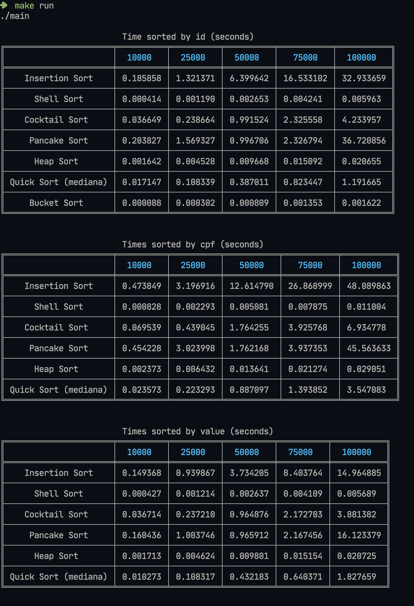

## Benchmark de algoritmos de ordenação
Este programa faz um benchmark para verificar o tempo de execução de alguns algoritmos de ordenação. Ele é feito baseando-se em dados do tipo _inteiro_, _string_ e _float_.  
Cada algoritmo é executado 10 vezes com tamanhos de vetores de: 10000, 25000, 50000, 75000 e 100000. No fim, é exibido uma tabela com a média de execução de cada algoritmo em segundos para cada tipo de dado.

## Instruções

```
make build
make run
```

Por ser um benchmark que faz a média de 10 execuções para cada tamanho, o tempo de execução do programa pode ser alto, podendo variar entre 50 e 60 minutos.

## Execução
 

**Observação:** A linha de Quicksort é um algoritmo de quicksort com mediana de 3 e utilizando insertion sort para partições com menores de cinco elementos, mais detalhes da implementação pode ser observado no arquivo `src/sort.c`.
